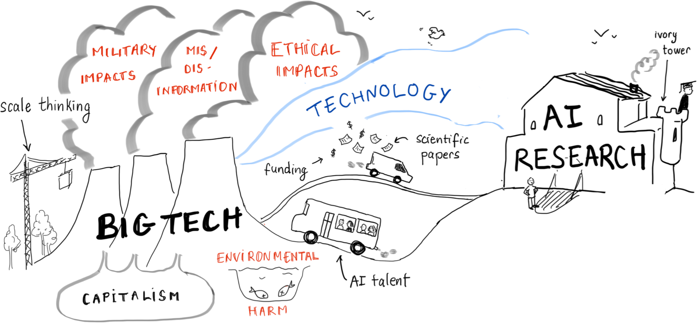
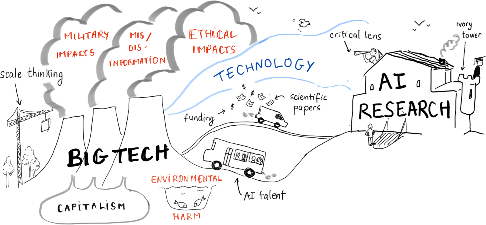
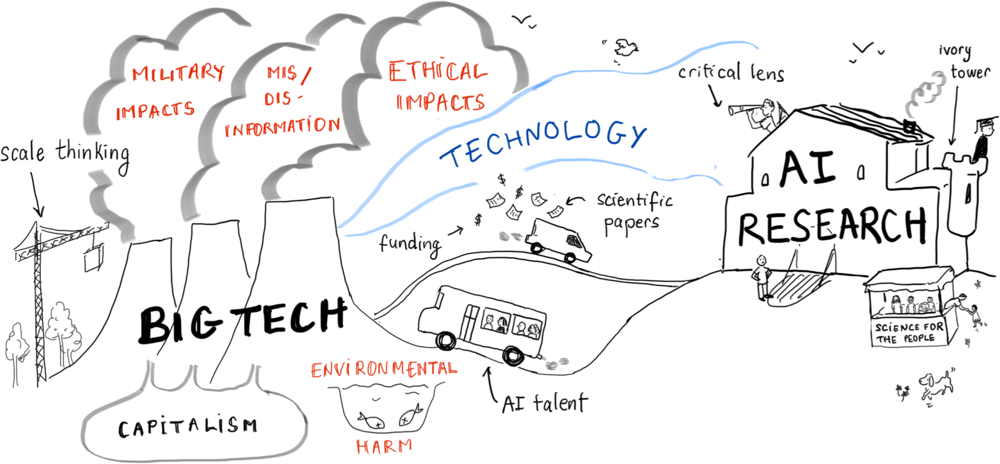
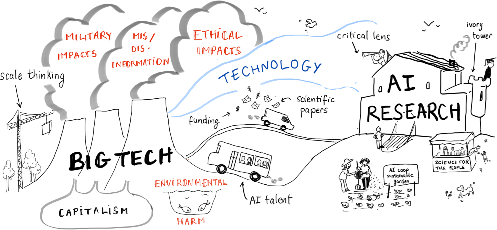

name: slides-icml26
class: title, middle, hide-slide-number

# Irresponsible AI
## Big tech’s influence on AI research and associated impacts

Alex Hernandez-Garcia, Alexandra Volokhova, Ezekiel Williams, Dounia Shaaban Kabakibo, Mélisande Teng 

.h1[ICML 2026 · Seoul · July 9 2026]

.center[

&nbsp&nbsp&nbsp&nbsp

]

.smaller[.footer[
Slides: [irresponsibleai.github.io/{{ name }}](https://irresponsibleai.github.io/{{ name }})
]]

.qrcode[]

---

## Irresponsible AI
### Big tech’s influence on AI research and associated impacts

.conclusion-float[Position: .h1[big tech]’s influence on AI research is an important driver of .h1[irresponsible AI] development.]

--

* Big tech significantly influences the AI research field.
* Major environmental and societal negative impacts of AI can be traced to this influence.
* Big tech is situated within capitalistic economic system
* Call to action: counter big tech's influence through critical approaches, building alternatives and collective action.

---

count: false

## Let's dig in!

.center[]

---

count: false

## This paper is about big tech...

.center[]

---

count: false

## …and its connection to AI research.

.center[]

---

count: false

## Big tech is good at producing technology

.center[]

---

count: false

## And it’s built solid bridges with academia

.center[]

---

count: false

## Big tech is involved in research collaborations…

.center[]

---

count: false

## …and it often funds academic research…

.center[]

---

## How much AI research is connected to big tech?

.center[]

.conclusion-affiliations[We analysed how many papers at the major ML conferences have at least one author affiliated with big tech.]

---

count: false

## How much AI research is connected to big tech?

.center[]

.conclusion-affiliations[In 2013, about 8-16 % of papers.]

---

count: false

## How much AI research is connected to big tech?

.center[]

.conclusion-affiliations[By 2020, papers with big tech authors had increased to represent ~30 %.]

---

count: false

## How much AI research is connected to big tech?

.center[]

.conclusion-affiliations[Since 2020, absolute numbers keep increasing but the fraction has decreased.]

---

## Big tech in turn extracts talent from academia

.center[]

---

count: false

## Big tech in turn extracts talent from academia

.center[]

---

## To what extent does big tech extract academic talent?

- The number of .h1[PhD graduates] from AI-related fields in US and Canadian universities .h1[that went to industry increased from 21 % in 2004 to 70 % in 2020] .cite[(Ahmed et al., 2023)].
- The number of .h1[professors who transitioned from academia to industry] has increased .h1[8x] since 2006 .cite[(Morrisett et al., 2019)].
- .h1[Joint faculty appointments] between universities and the industry have also increased.

.references[
- Ahmed et al. [The growing influence of industry in AI research](https://www.science.org/doi/10.1126/science.ade2420). Science, 2023.
- Morrisett et al. Evolving academia/industry relations in computing research. arXiv:1903.10375, 2019.
]

---

count: false

## To what extent does big tech extract academic talent?

- The number of .h1[PhD graduates] from AI-related fields in US and Canadian universities .h1[that went to industry increased from 21 % in 2004 to 70 % in 2020] .cite[(Ahmed et al., 2023)].
- The number of .h1[professors who transitioned from academia to industry] has increased .h1[8x] since 2006 .cite[(Morrisett et al., 2019)].
- .h1[Joint faculty appointments] between universities and the industry have also increased.

.conclusion[These trends have consequences in terms of department culture shift, research directions, conflicts of interest and the quality of the mentorship students receive.]

---

## This allows big tech to influence the research agenda

.center[]

---

count: false

## This allows big tech to influence the research agenda

.center[]

---

## What research themes and trends has big tech helped establish?

--

.left-column[
<pre>
</pre>
### Scale thinking

The belief that the main driver for progress in AI is increasing the amount of data, model size, etc.: .h1["bigger is better"], .h1["scaling is all you need"].

- Big tech has a competitive advantage in scaling because they control access to data and compute.
- Big tech profits from cloud computing and data centres, so scaling is part of their business model. 
]

--

.right-column[
<pre>
</pre>
### General-purpose thinking

The design philosophy that seeks to develop task-agnostic AI methods and products, as opposed to tailored and domain-inspired approaches, epitomised by the .h1[AGI slogan].

- This approach is tied to big tech’s business model and competition for monopolising and controlling the technology market.
- An example is current commercial chatbots, designed and sold as usable for a wide range of tasks.
]

--

.full-width[
.conclusion[While general-purpose and scaling might offer practical benefits in some cases, we question the impact of these paradigms, and whether alternative approaches can bring the same or even higher benefits.]
]

---

## Big tech’s influence has specific impacts…

.center[]

---

count: false

## Big tech’s influence has specific impacts…

.center[]

.conclusion[The large-scale deployment of AI systems based on big models has serious .h2[ecological impacts in terms of energy, water and raw materials].]

---

count: false

## Big tech’s influence has specific impacts…

.center[]

.conclusion[Under the scaling paradigm, .h2[ethics tend to be disregarded]: it facilitates a transactional attitude towards AI development, detached from the people impacted by technology .cite[(Widder and Nafus, 2023)].]

---

count: false

## Big tech’s influence has specific impacts…

.center[]

.conclusion[.h2[AI slop], the spread of .h2[mis- and dis-information] and the .h2[degradation of paper and peer-review quality] are growing concerns, driven by the uncritical deployment of AI systems and social media by big tech.]

---

count: false

## Big tech’s influence has specific impacts…

.center[]

.conclusion[AI is increasingly used in .h2[warfare] and big tech companies have growing ties with .h2[weapon manufacturers and authoritarian regimes], some even under investigation for the crime of genocide.]

---

## And why is big tech a major driver of these negative impacts?

.center[]

---

count: false

## And why is big tech a major driver of these negative impacts?

.center[]

.conclusion[Features of the .h2[capitalist economy] encourage .h2[profit seeking] and cause .h2[growth imperatives] for tech firms. This leads to big tech .h2[prioritizing profit and growth over socioecological well-being].]

---

count: false

## And why is big tech a major driver of these negative impacts?

.center[]

.conclusion[The .h2[concentration of wealth, power, and knowledge] in big tech allows these companies to escape regulation. Thus, regulatory and technical solutions are not enough.]

---

## Call to action: What can we do as AI researchers?

.center[]

---

count: false

## Call to action: What can we do as AI researchers?

.center[]

.conclusion[Educate ourselves on critical perspectives.]

---

count: false

## Call to action: What can we do as AI researchers?

.center[]

.conclusion[.h2[Join organisations and collectives] advocating for more democratic, ethical and sustainable science and technology.]

---

count: false

## Call to action: What can we do as AI researchers?

.center[]

.conclusion[.h2[Tech cooperatives and non-profits] are alternative, more democratic forms of entrepreneurship, less influenced by the growth imperative and competition.]

---

count: false

## Call to action: What can we do as AI researchers?

.center[]

.conclusion[Researchers in big tech companies can play an important role in .h2[critically countering power structures from inside].]

---

<table class="styled-table">
  <thead>
    <tr>
      <th>Alternative views</th>
      <th>Our answer</th>
    </tr>
  </thead>
  <tbody>
    <tr class="hide-row">
      <td>Big tech’s influence on the research agenda enables progress.</td>
      <td>We question the assumption that supposed progress outweighs the current and potential socioecological impacts of the rapid deployment of AI systems at scale.</td>
    </tr>
    <tr class="hide-row">
      <td>Environmental impacts of big tech are overstated.</td>
      <td>There is still high uncertainty due to lack of transparency and global aggregates obscure salient local effects such as stressed energy grids and water scarcity.</td>
    <tr class="hide-row">
      <td>Top-down structural reform should be the priority.</td>
      <td>Regulatory guardrails can themselves be shaped by the same pressures they aim to constrain, and top-down change rarely occurs in the absence of bottom-up pressure.</td>
    <tr class="hide-row">
      <td>Alternative actors could have led to similar outcomes.</td>
      <td>The unique role played by big tech creates conditions and strong incentives toward irresponsible development.</td>
    </tr>
    <tr class="hide-row">
      <td>Capitalism as the most viable current option.</td>
      <td>We leave this question open and invite AI researchers to reflect on the broader structural conditions that shape the research and development of AI.</td>
    </tr>
  </tbody>
</table>

---

count: false

<table class="styled-table">
  <thead>
    <tr>
      <th>Alternative views</th>
      <th>Our answer</th>
    </tr>
  </thead>
  <tbody>
    <tr class="active-row">
      <td>Big tech’s influence on the research agenda enables progress.</td>
      <td>We question the assumption that supposed progress outweighs the current and potential socioecological impacts of the rapid deployment of AI systems at scale.</td>
    </tr>
    <tr class="hide-row">
      <td>Environmental impacts of big tech are overstated.</td>
      <td>There is still high uncertainty due to lack of transparency and global aggregates obscure salient local effects such as stressed energy grids and water scarcity.</td>
    <tr class="hide-row">
      <td>Top-down structural reform should be the priority.</td>
      <td>Regulatory guardrails can themselves be shaped by the same pressures they aim to constrain, and top-down change rarely occurs in the absence of bottom-up pressure.</td>
    <tr class="hide-row">
      <td>Alternative actors could have led to similar outcomes.</td>
      <td>The unique role played by big tech creates conditions and strong incentives toward irresponsible development.</td>
    </tr>
    <tr class="hide-row">
      <td>Capitalism as the most viable current option.</td>
      <td>We leave this question open and invite AI researchers to reflect on the broader structural conditions that shape the research and development of AI.</td>
    </tr>
  </tbody>
</table>

---

count: false

<table class="styled-table">
  <thead>
    <tr>
      <th>Alternative views</th>
      <th>Our answer</th>
    </tr>
  </thead>
  <tbody>
    <tr>
      <td>Big tech’s influence on the research agenda enables progress.</td>
      <td>We question the assumption that supposed progress outweighs the current and potential socioecological impacts of the rapid deployment of AI systems at scale.</td>
    </tr>
    <tr class="active-row">
      <td>Environmental impacts of big tech are overstated.</td>
      <td>There is still high uncertainty due to lack of transparency and global aggregates obscure salient local effects such as stressed energy grids and water scarcity.</td>
    <tr class="hide-row">
      <td>Top-down structural reform should be the priority.</td>
      <td>Regulatory guardrails can themselves be shaped by the same pressures they aim to constrain, and top-down change rarely occurs in the absence of bottom-up pressure.</td>
    <tr class="hide-row">
      <td>Alternative actors could have led to similar outcomes.</td>
      <td>The unique role played by big tech creates conditions and strong incentives toward irresponsible development.</td>
    </tr>
    <tr class="hide-row">
      <td>Capitalism as the most viable current option.</td>
      <td>We leave this question open and invite AI researchers to reflect on the broader structural conditions that shape the research and development of AI.</td>
    </tr>
  </tbody>
</table>

---

count: false

<table class="styled-table">
  <thead>
    <tr>
      <th>Alternative views</th>
      <th>Our answer</th>
    </tr>
  </thead>
  <tbody>
    <tr>
      <td>Big tech’s influence on the research agenda enables progress.</td>
      <td>We question the assumption that supposed progress outweighs the current and potential socioecological impacts of the rapid deployment of AI systems at scale.</td>
    </tr>
    <tr>
      <td>Environmental impacts of big tech are overstated.</td>
      <td>There is still high uncertainty due to lack of transparency and global aggregates obscure salient local effects such as stressed energy grids and water scarcity.</td>
    <tr class="active-row">
      <td>Top-down structural reform should be the priority.</td>
      <td>Regulatory guardrails can themselves be shaped by the same pressures they aim to constrain, and top-down change rarely occurs in the absence of bottom-up pressure.</td>
    <tr class="hide-row">
      <td>Alternative actors could have led to similar outcomes.</td>
      <td>The unique role played by big tech creates conditions and strong incentives toward irresponsible development.</td>
    </tr>
    <tr class="hide-row">
      <td>Capitalism as the most viable current option.</td>
      <td>We leave this question open and invite AI researchers to reflect on the broader structural conditions that shape the research and development of AI.</td>
    </tr>
  </tbody>
</table>

---

count: false

<table class="styled-table">
  <thead>
    <tr>
      <th>Alternative views</th>
      <th>Our answer</th>
    </tr>
  </thead>
  <tbody>
    <tr>
      <td>Big tech’s influence on the research agenda enables progress.</td>
      <td>We question the assumption that supposed progress outweighs the current and potential socioecological impacts of the rapid deployment of AI systems at scale.</td>
    </tr>
    <tr>
      <td>Environmental impacts of big tech are overstated.</td>
      <td>There is still high uncertainty due to lack of transparency and global aggregates obscure salient local effects such as stressed energy grids and water scarcity.</td>
    <tr>
      <td>Top-down structural reform should be the priority.</td>
      <td>Regulatory guardrails can themselves be shaped by the same pressures they aim to constrain, and top-down change rarely occurs in the absence of bottom-up pressure.</td>
    <tr class="active-row">
      <td>Alternative actors could have led to similar outcomes.</td>
      <td>The unique role played by big tech creates conditions and strong incentives toward irresponsible development.</td>
    </tr>
    <tr class="hide-row">
      <td>Capitalism as the most viable current option.</td>
      <td>We leave this question open and invite AI researchers to reflect on the broader structural conditions that shape the research and development of AI.</td>
    </tr>
  </tbody>
</table>

---

count: false

<table class="styled-table">
  <thead>
    <tr>
      <th>Alternative views</th>
      <th>Our answer</th>
    </tr>
  </thead>
  <tbody>
    <tr>
      <td>Big tech’s influence on the research agenda enables progress.</td>
      <td>We question the assumption that supposed progress outweighs the current and potential socioecological impacts of the rapid deployment of AI systems at scale.</td>
    </tr>
    <tr>
      <td>Environmental impacts of big tech are overstated.</td>
      <td>There is still high uncertainty due to lack of transparency and global aggregates obscure salient local effects such as stressed energy grids and water scarcity.</td>
    <tr>
      <td>Top-down structural reform should be the priority.</td>
      <td>Regulatory guardrails can themselves be shaped by the same pressures they aim to constrain, and top-down change rarely occurs in the absence of bottom-up pressure.</td>
    <tr>
      <td>Alternative actors could have led to similar outcomes.</td>
      <td>The unique role played by big tech creates conditions and strong incentives toward irresponsible development.</td>
    </tr>
    <tr class="active-row">
      <td>Capitalism as the most viable current option.</td>
      <td>We leave this question open and invite AI researchers to reflect on the broader structural conditions that shape the research and development of AI.</td>
    </tr>
  </tbody>
</table>

---

exclude: true

## Title
### Subtitle

.context[This is the context box.]

This is some text. .cite[(A citation appears smaller)]

This is text with a [hyperlink](https://www.ecosia.org/).

- This text uses .highlight1[Highlight 1]
- This text uses .h1[Highlight 1]
- This text uses .highlight2[Highlight 2]
- This text uses .h2[Highlight 2]

.references[Some references, which appear at the bottom left.]

.conclusion[This is the conclusion box.]

---

## Conclusion

.conclusion-float[.h1[Big tech]’s influence on AI research is an important driver of .h1[irresponsible AI] development.]

--

.conclusion-float[As AI researchers, we have agency to counter this influence and help steer the development of AI towards more ethical and sustainable paths.]

--

Join us and other critical AI researchers on [Signal](https://signal.org/)!

.center[]

---

name: slides-icml26
class: title, middle, hide-slide-number

# Irresponsible AI
## Big tech’s influence on AI research and associated impacts

Alex Hernandez-Garcia, Alexandra Volokhova, Ezekiel Williams, Dounia Shaaban Kabakibo, Mélisande Teng 

.h1[ICML 2026 · Seoul · July 9 2026]

.center[

&nbsp&nbsp&nbsp&nbsp

]

.smaller[.footer[
Slides: [irresponsibleai.github.io/{{ name }}](https://irresponsibleai.github.io/{{ name }})
]]

