name: slides-icml26
class: title, middle

# Irresponsible AI
## Big tech’s influence on AI research and associated impacts

Alex Hernandez-Garcia, Alexandra Volokhova, Ezekiel Williams, Dounia Shaaban Kabakibo, Mélisande Teng 

.h1[ICML 2026 · Seoul · July 9 2026]

.center[

&nbsp&nbsp&nbsp&nbsp

]

.smaller[.footer[
Slides: [irresponsibleai.github.io/{{ name }}](https://irresponsibleai.github.io/{{ name }})
]]

---

## Irresponsible AI
### Big tech’s influence on AI research and associated impacts

.conclusion[Position: .h1[big tech]’s influence on AI research is an important driver of .h1[irresponsible AI] development.]

--

- We examine the growing and disproportionate influence of big tech in AI research.
- We argue that big tech's drive for scaling and general-purpose systems is fundamentally at odds with the responsible, ethical, and sustainable development of AI.
- We review key current environmental and societal negative impacts of AI and trace their connections to big tech’s influence.
- We discuss the underlying economic forces driving big tech’s action.
- As a call to action, we invite AI researchers to counter big tech’s influence in irresponsible AI development through strategies that build on the responsibility of implicated actors and collective action.

---

count: false

## Let's dig in!

.center[]

---

count: false

## This paper is about big tech...

.center[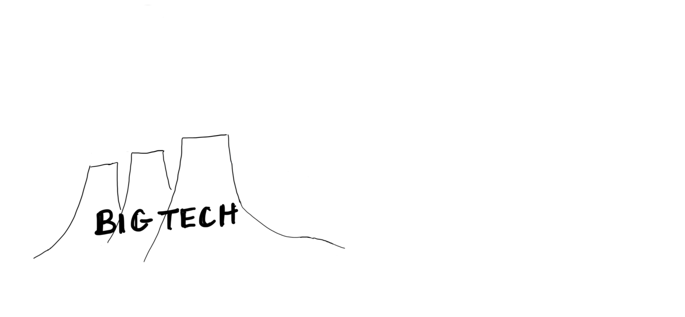]

---

count: false

## …and its connection to AI research.

.center[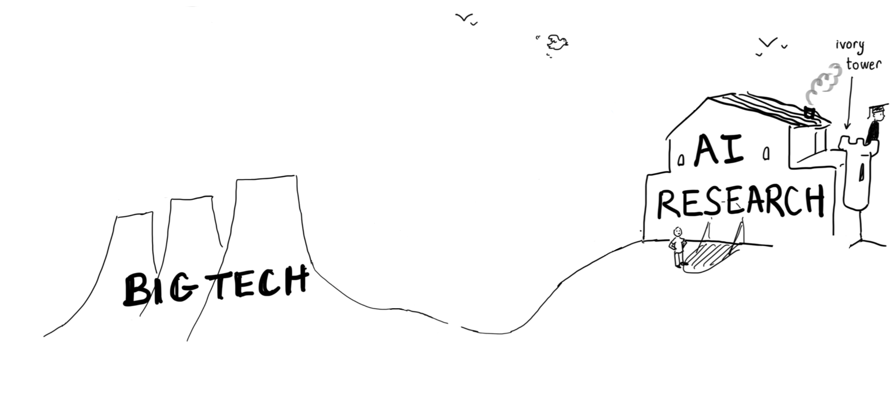]

---

count: false

## Big tech is good at producing technology

.center[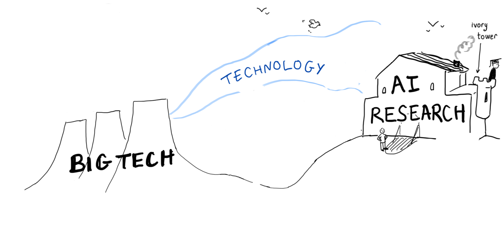]

---

count: false

## And it’s built solid bridges with academia

.center[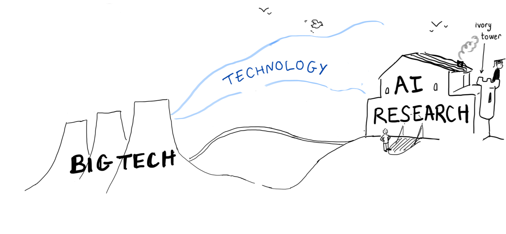]

---

count: false

## Big tech is involved in research collaborations…

.center[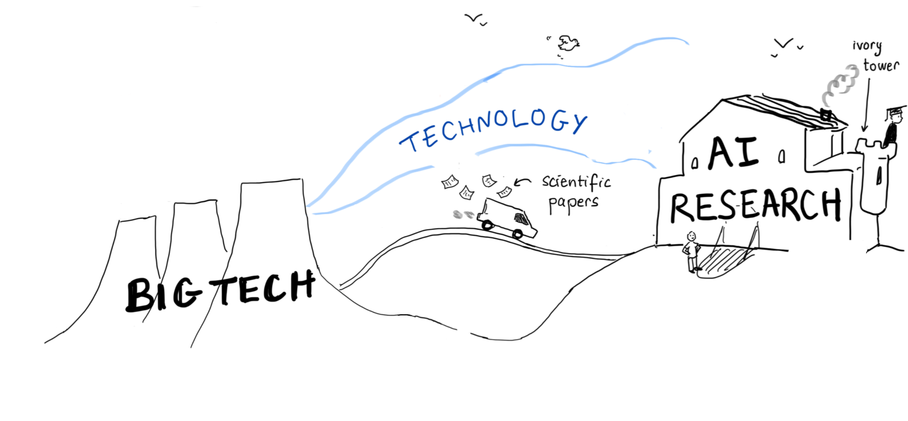]

---

count: false

## …and it often funds academic research…

.center[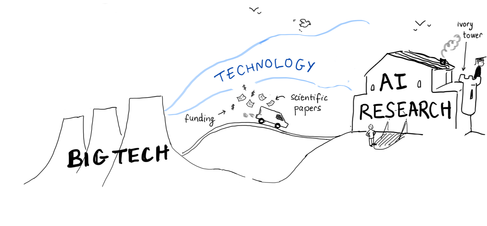]

---

## How much AI research is connected to big tech?

.center[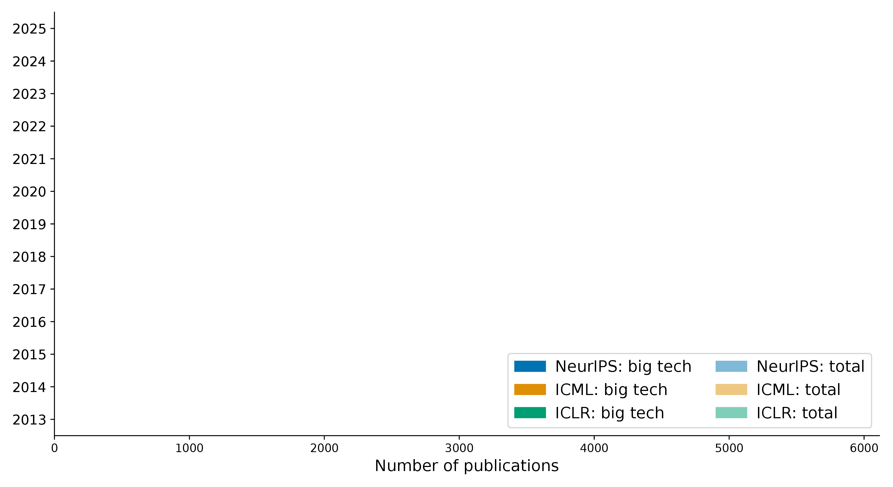]

.conclusion-affiliations[We analysed how many papers at the major ML conferences have at least one author affiliated with big tech.]

---

count: false

## How much AI research is connected to big tech?

.center[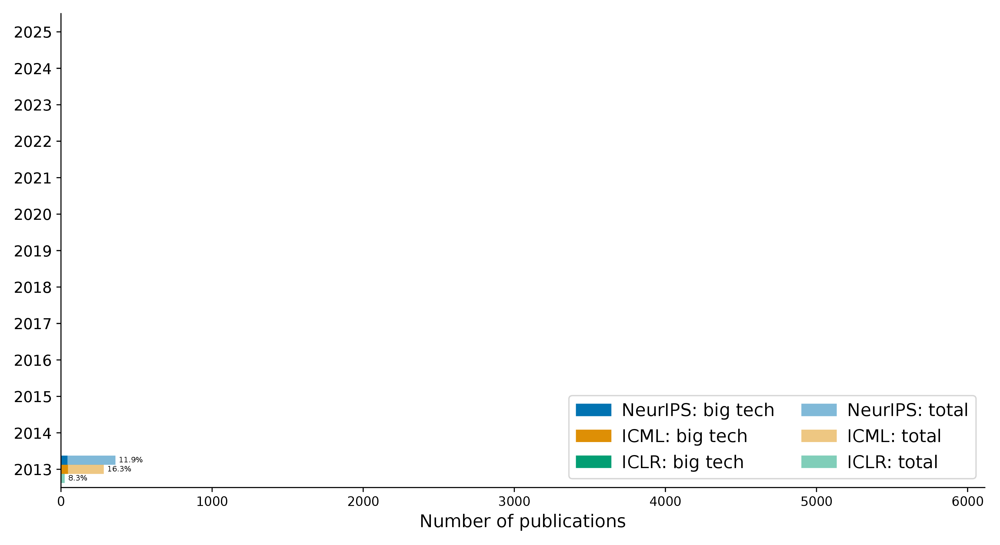]

.conclusion-affiliations[In 2013, about 8-16 % of papers.]

---

count: false

## How much AI research is connected to big tech?

.center[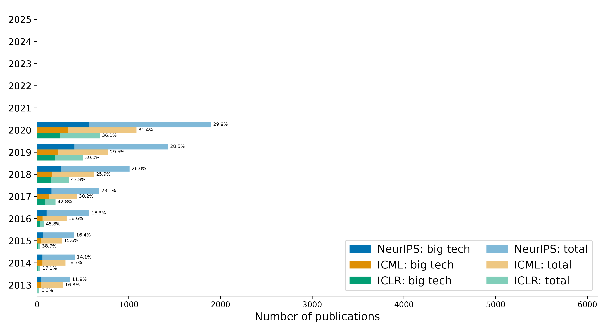]

.conclusion-affiliations[Until 2020, papers with big tech authors increased until about 30 %.]

---

count: false

## How much AI research is connected to big tech?

.center[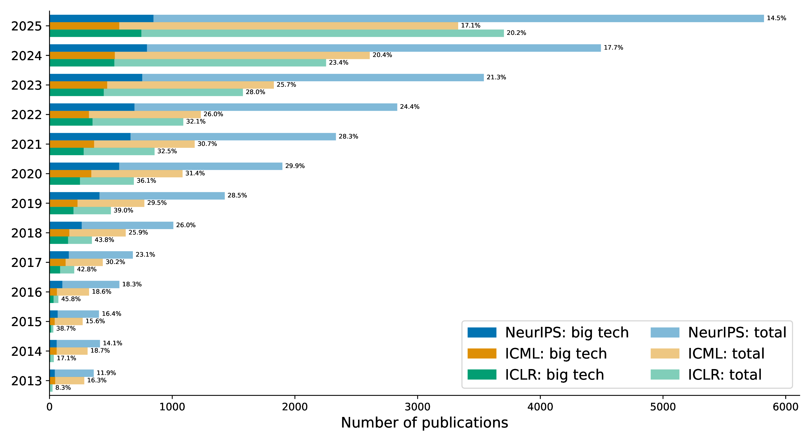]

.conclusion-affiliations[Since 2020, absolute numbers keep increasing but the fraction has decreased.]

---

## Big tech in turn extracts talent from academia

.center[]

---

count: false

## Big tech in turn extracts talent from academia

.center[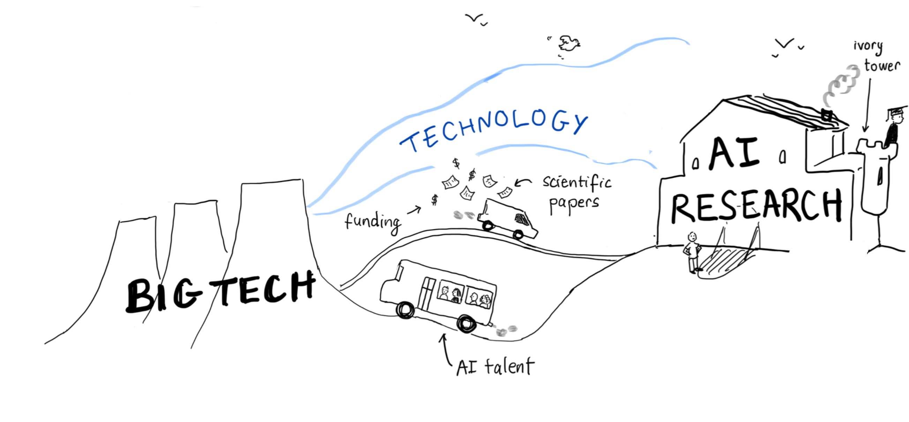]

---

## To what extent does big tech extract academic talent?

- The number of .h1[PhD graduates] from AI-related fields in US and Canadian universities .h1[that went to industry increased from 21 % in 2004 to 70 % in 2020] .cite[(Ahmed et al., 2023)].
- The number of .h1[professors who transitioned from academia to industry] has increased .h1[8x] since 2006 .cite[(Morrisett et al., 2019)].
- .h1[Joint faculty appointments] between universities and the industry have also increased.

.references[
- Ahmed et al. [The growing influence of industry in AI research](https://www.science.org/doi/10.1126/science.ade2420). Science, 2023.
- Morrisett et al. Evolving academia/industry relations in computing research. arXiv:1903.10375, 2019.

---

count: false

## To what extent does big tech extract academic talent?

- The number of .h1[PhD graduates] from AI-related fields in US and Canadian universities .h1[that went to industry increased from 21 % in 2004 to 70 % in 2020] .cite[(Ahmed et al., 2023)].
- The number of .h1[professors who transitioned from academia to industry] has increased .h1[8x] since 2006 .cite[(Morrisett et al., 2019)].
- .h1[Joint faculty appointments] between universities and the industry have also increased.

.conclusion[These trends are having consequences in terms of department culture shift, research directions, conflicts of interest and the quality of the mentorship students receive.]

---

## This allows big tech to influence the research agenda

.center[]

---

count: false

## This allows big tech to influence the research agenda

.center[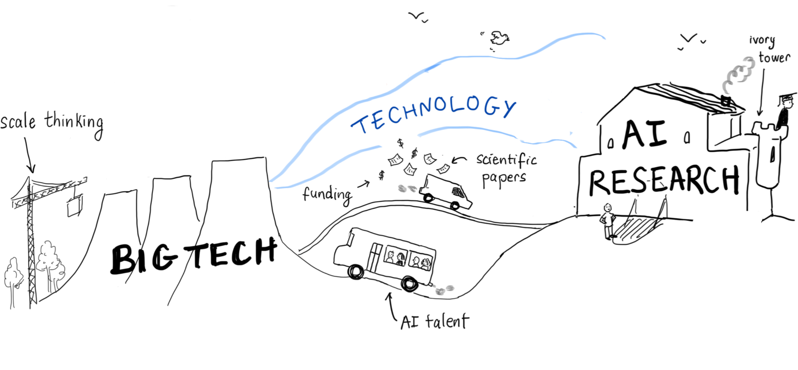]

---

## What research themes and trends has big tech help establish?

--

.left-column[
### Scale thinking

The belief that the main driver for progress in AI is increasing the amount of data, model size, etc.: .h1["bigger is better"], .h1["scaling is all you need"].

- Big tech has a competitive advantage in scaling because they control access to data and compute.
- Big tech profits from cloud computing and data centres, so scaling is part of their business model. 
]

--

.right-column[
### General-purpose thinking

The design philosophy that seeks to develop task-agnostic AI methods and products, as opposed to tailored and domain-inspired approaches, epitomised by the .h1[AGI slogan].

- This approach is tied to big tech’s business model and competition for monopolising and controlling the technology market.
- An example is current commercial chatbots, designed and sold as usable for a wide range of tasks.
]

--

.full-width[
.conclusion[While general-purpose and scaling might offer practical benefits in some cases, we question the impact of these paradigms, and whether alternative approaches can bring the same or even higher benefits.]
]

---

## Big tech’s influence has specific impacts…

.center[]

---

count: false

## Big tech’s influence has specific impacts…

.center[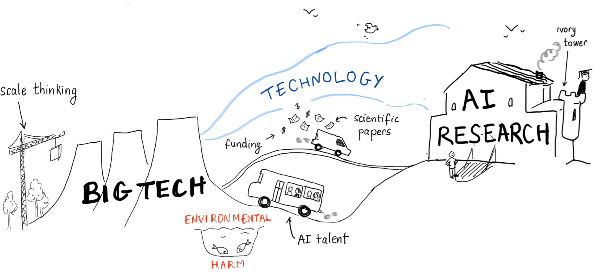]

.conclusion[The large-scale deployment of AI systems based on big models has serious .h2[ecological impacts in terms of energy, water and raw materials].]

---

count: false

## Big tech’s influence has specific impacts…

.center[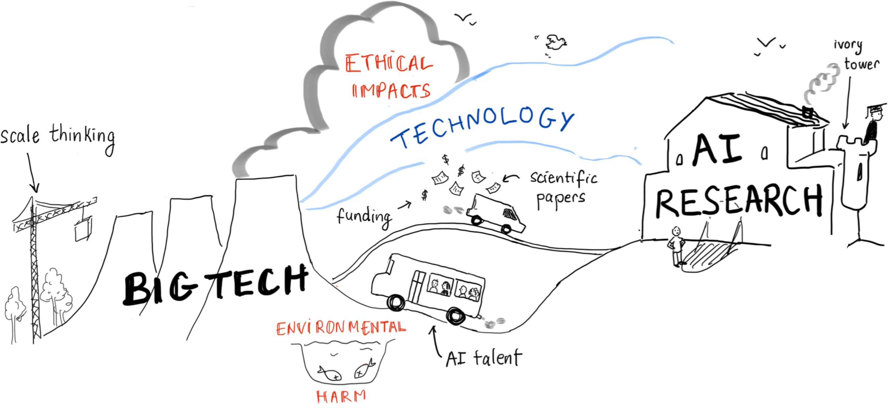]

.conclusion[In the drive to scale, .h2[ethics tends to be disregarded]. The scaling paradigm facilitates a modularised, transactional attitude towards AI development .cite[(Widder and Nafus, 2023)].]

---

count: false

## Big tech’s influence has specific impacts…

.center[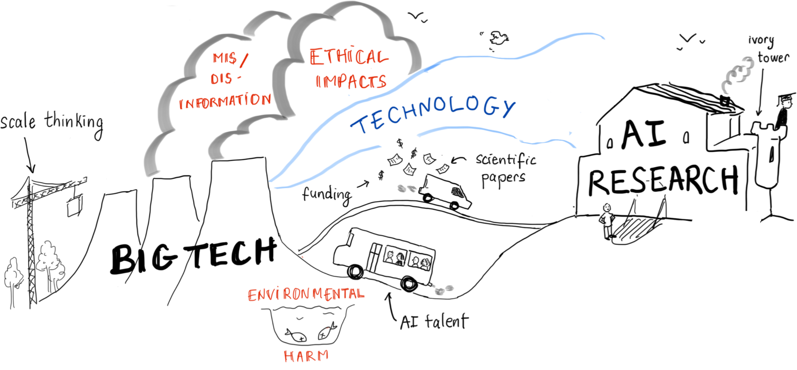]

.conclusion[AI slop and the spread of mis- and dis-information is a growing concern, driven by the uncritical deployment of AI systems and social media by big tech.]

---

count: false

## Big tech’s influence has specific impacts…

.center[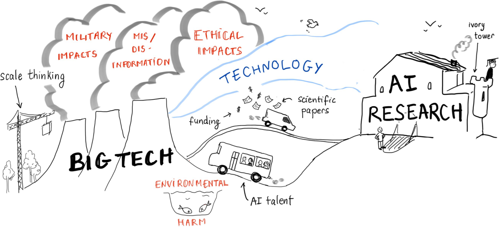]

---

## Irresponsible AI

.center[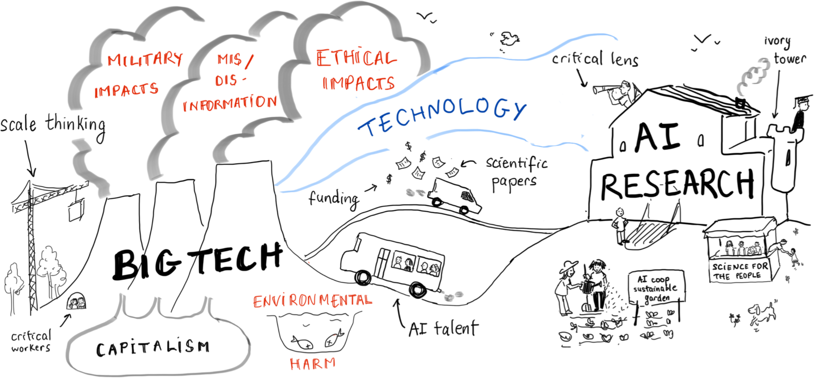]

---

## Title
### Subtitle

.context[This is the context box.]

This is some text. .cite[(A citation appears smaller)]

This is text with a [hyperlink](https://www.ecosia.org/).

- This text uses .highlight1[Highlight 1]
- This text uses .h1[Highlight 1]
- This text uses .highlight2[Highlight 2]
- This text uses .h2[Highlight 2]

.references[Some references, which appear at the bottom left.]

.conclusion[This is the conclusion box.]
